# Automasked ROC Frequency Plotter

This tool processes time-resolved automasking data for Pixel ROCs in the CMS detector, computes the **frequency of masking** across a complete fill, and generates 2D digiplots to visualize the results. It also prints a **summary table** showing how many ROCs were automasked and blacklisted per detector layer.

---

## Script Location

```
/pixel/users/Calibrations/automasked_frequency_plots/
```

---

## Workflow

### 1. Get Fill Info from CMSOMS

Visit [CMSOMS](https://cmsoms.cern.ch/) to find the **start** and **end times** of the **stable beams** period for your fill. Also note the **fill number**.

The script pulls input data from:

```
/nfspixelraid/nfspixelraid/users/masks/automasked_channels/
```

---

### 2. Log In and Set Up

```bash
ssh srv-s2b18-31-01
sudo -u pixelpro -H zsh -l

cd /nfshome0/pixelpro/TriDAS
source setenv.sh
cd /pixel/users/Calibrations/automasked_frequency_plots
```

---

### 3. Run the Script

#### Basic usage:

```bash
python3 plot_rocs_summary.py --fill <FILL> --start "YYYY-MM-DD HH:MM:SS" --end "YYYY-MM-DD HH:MM:SS"
```

#### Optional flags:

- `-blacklisted` – Only include ROCs that were blacklisted.
  - Output will be saved under:  
    `/pixel/users/Calibrations/automasked_frequency_plots/fill_<FILL>/blacklisted/`
- `-save` – Save the expanded ROC list used for the plots.

---

## Example

```bash
python3 plot_rocs_summary.py --fill 10674 \
  --start "2025-05-29 21:23:54" \
  --end "2025-05-30 03:34:24" -save
```

---

## Output

Output is saved to:

```
/pixel/users/Calibrations/automasked_frequency_plots/fill_<FILL>/
```

If `-blacklisted` is used:

```
/pixel/users/Calibrations/automasked_frequency_plots/fill_<FILL>/blacklisted/
```

Includes:
- ROC frequency plots (`PXBarrel_LayerX.png`, `PXForward_RingX.png`)
- Printed summary table (see below)
- (Optional) expanded input list (`fill_<FILL>.dat`)

---

## Summary Output (Example)

The following summary was produced for **fill 10673**, with data from:

```
Start: 2025-05-29 05:38:14
End:   2025-05-29 18:37:00
```

Run without `-blacklisted`:

```
================================================================================
                                    SUMMARY
================================================================================
Layer        Masked    Total    % Automasked    Blacklisted   % Blacklisted
--------------------------------------------------------------------------------
BPix L1         198     1536          12.89%             50           3.26%
BPix L2         308     3584           8.59%            124           3.46%
BPix L3         200     5632           3.55%             88           1.56%
BPix L4         104     8192           1.27%             32           0.39%
FPix D1         592     3584          16.52%            104           2.90%
FPix D2         848     3584          23.66%             24           0.67%
FPix D3         384     3584          10.71%             48           1.34%
--------------------------------------------------------------------------------
Total          2634    29696           8.87%            470           1.58%
```

Then run again with `-blacklisted`:

```bash
python3 plot_rocs_summary.py --fill 10673 \
  --start "2025-05-29 05:38:14" \
  --end "2025-05-29 18:37:00" -blacklisted
```

---

## Example Plots for Fill 10673

The following digiplots show how many minutes each ROC was automasked or blacklisted during fill 10673. The **Z-axis** (color scale) indicates the **total number of minutes** the ROC was masked.

### All Automasked Channels (including blacklisted)

| Layer | Plot |
|-------|------|
| PXBarrel Layer 1 | 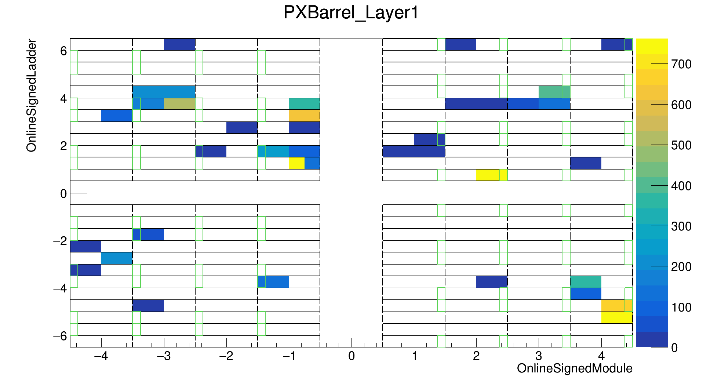 |
| PXBarrel Layer 2 | 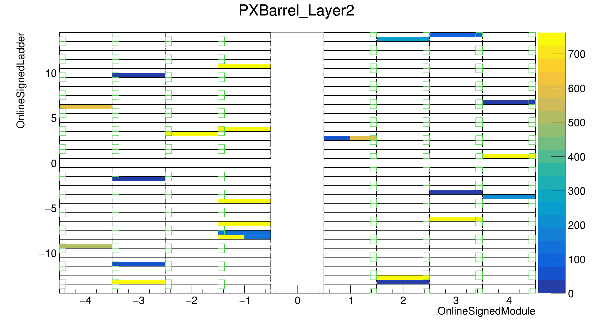 |
| PXBarrel Layer 3 | 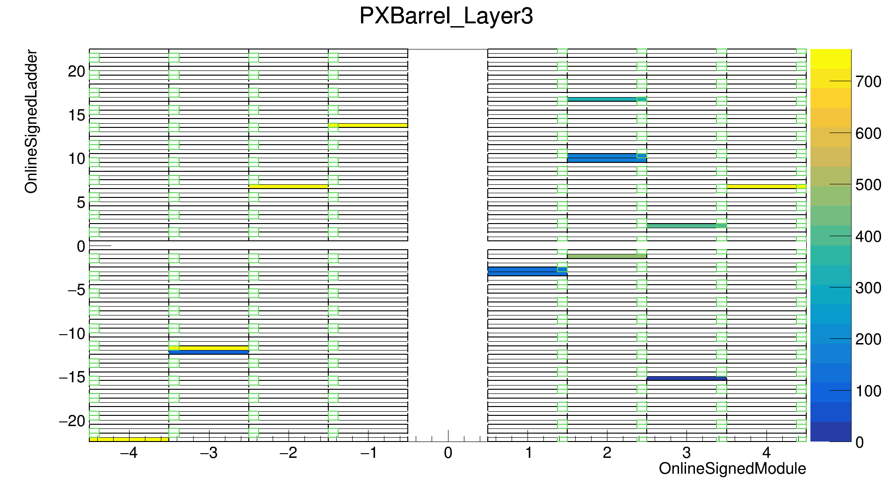 |
| PXBarrel Layer 4 | 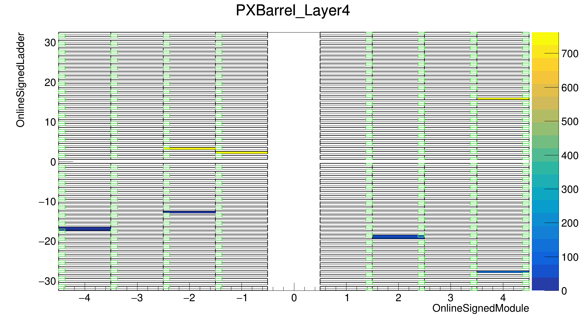 |
| PXForward Ring 1 | 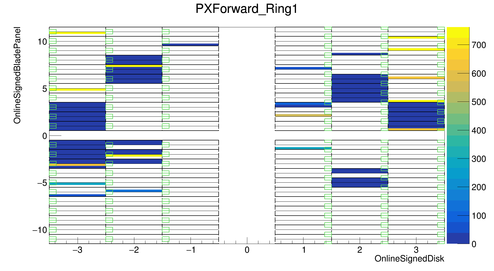 |
| PXForward Ring 2 | 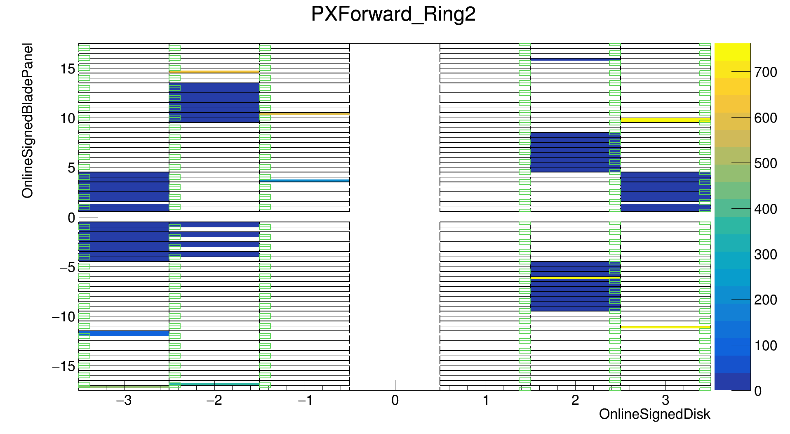 |

### Only Blacklisted Channels

| Layer | Plot |
|-------|------|
| PXBarrel Layer 1 | 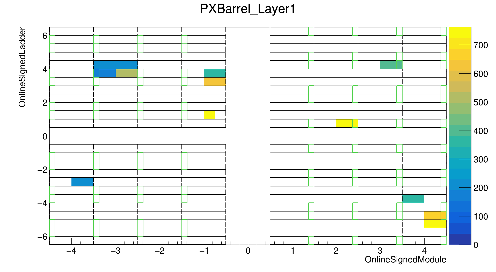 |
| PXBarrel Layer 2 | 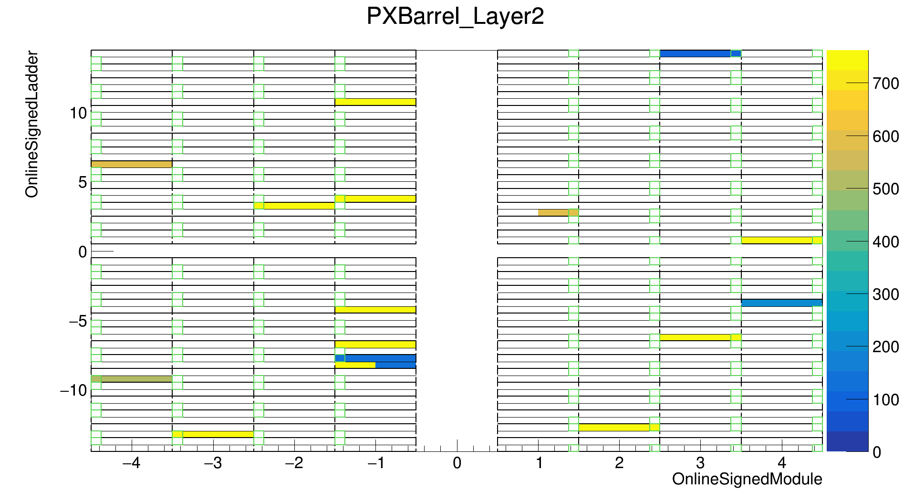 |
| PXBarrel Layer 3 | 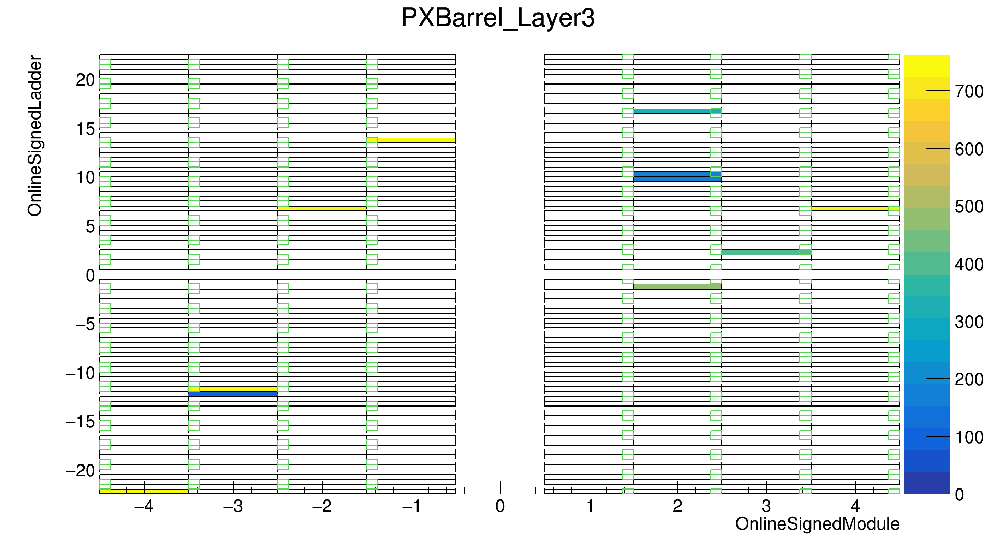 |
| PXBarrel Layer 4 | 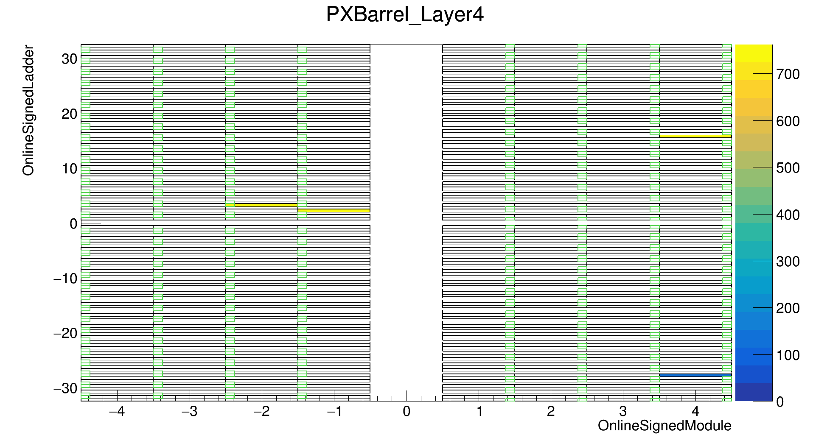 |
| PXForward Ring 1 | 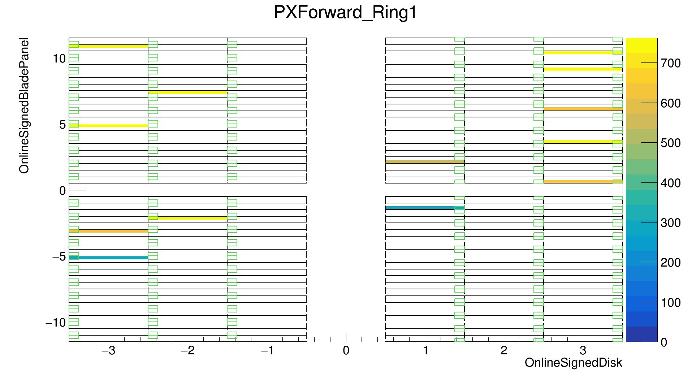 |
| PXForward Ring 2 | 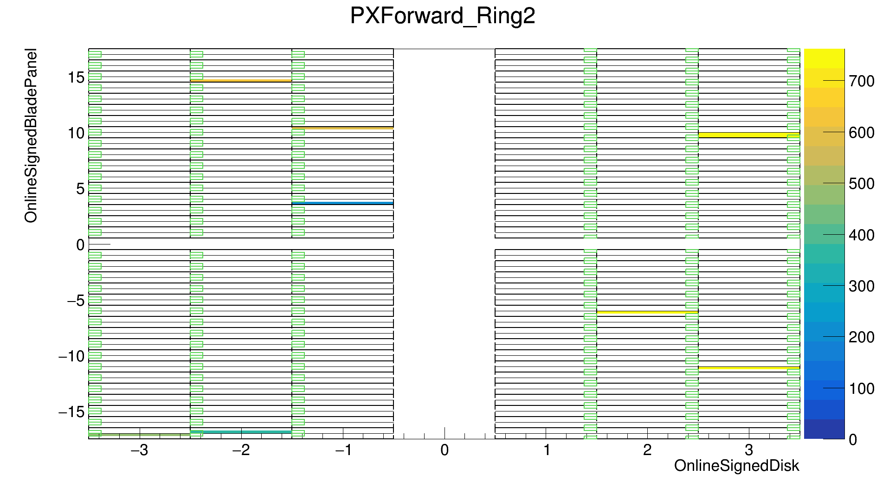 |

---

## Authors

- Script & Analysis: Athar Ahmad
